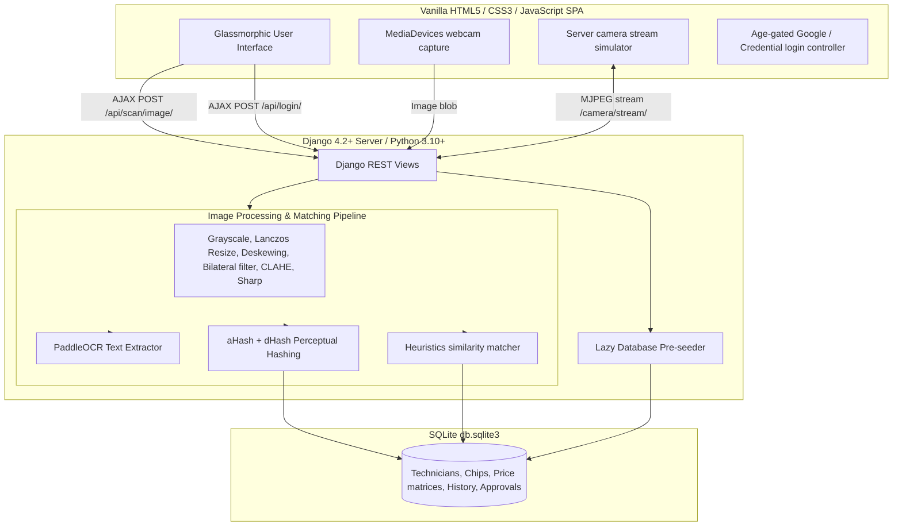

# ChipScan PH - System Architecture & Overview

Welcome to the technical overview of **ChipScan PH**, a premium mobile-responsive smartphone storage chip grading and valuation application designed for repair shop technicians and administrators.

---

## 1. System Architecture



---

## 2. Technology Stack

- **Backend**: Python 3.10+ & Django 4.2+
- **Database**: SQLite (`db.sqlite3` located in the project root)
- **OCR Engine**: **PaddleOCR** (python package: `paddleocr`, using standard English deep-learning model)
- **Image Handling**: 
  - **Pillow** with HEIF support via `pillow-heif` (for seamless uploads of `.heic` and `.heif` files from iOS devices)
  - **OpenCV** (`opencv-python` and `opencv-contrib-python`) for advanced matrix manipulations
- **Frontend**: Vanilla HTML5, CSS3 (Modern Glassmorphism with light/dark templates, active transitions, and scale micro-animations), and Vanilla JavaScript SPA controller (no external frameworks).

---

## 3. Directory Layout

```text
ChipScan_PH/
│
├── chipscan_project/
│   ├── __init__.py
│   ├── asgi.py
│   ├── settings.py          # App settings, media/static configuration & MD5 password hashers
│   ├── urls.py              # Main project URL router
│   └── wsgi.py
│
├── scanner/
│   ├── migrations/          # SQLite database schema migration files
│   ├── static/
│   │   ├── css/
│   │   │   └── styles.css   # Glassmorphic, light/dark responsive stylesheet
│   │   └── js/
│   │       └── app.js       # SPA router, webcam grabber & AJAX coordinator
│   │
│   ├── templates/
│   │   └── index.html       # Single Page Application HTML shell
│   │
│   ├── __init__.py
│   ├── models.py            # Django models for users, pricing, catalog & approvals
│   ├── seeder.py            # Lazy pre-seeder script containing 28 standard chips
│   ├── ocr_pipeline.py      # Grayscale, Bilateral filter, CLAHE, deskewing, aHash+dHash, PaddleOCR
│   ├── views.py             # REST API controllers & camera simulator MJPEG stream
│   ├── urls.py              # App-specific URL endpoints mapping
│   └── tests.py             # Django unit tests suite
│
├── media/                   # Uploaded scans and chip reference images (autogenerated)
├── manage.py
├── system_overview.md       # (This file)
└── db.sqlite3               # SQLite database file (autogenerated)
```

---

## 4. Database Models

The system implements the following 7 models inside [models.py](file:///c:/Users/Administrator/Desktop/ChipScan_PH/scanner/models.py):

1. **Technician**:
   - `username` (CharField, unique, max_length=50)
   - `password` (CharField, max_length=50): Stored in database using MD5 hashing (fits in 50 chars as `md5$salt$hash`). Supports fallbacks for plain-text or plain MD5 hashes.
   - `role` (CharField, choices: `admin` / `tech`, default=`tech`)
2. **Chip**:
   - `code` (CharField, unique, max_length=50, db_index=True)
   - `grade` (CharField, max_length=5)
   - `size` (CharField, max_length=20)
   - `type` (CharField, max_length=50)
   - `maker` (CharField, max_length=50)
   - `note` (TextField)
   - `is_manual` (BooleanField, default=False)
   - `status` (CharField, choices: `coded` / `noncode`, default=`coded`)
   - `alias` (CharField, max_length=100)
   - `alternate_codes` (CharField, max_length=200)
   - `ocr_text` (TextField)
   - `reference_image` (ImageField, uploads to `chips/`)
   - `image_hash` (CharField, max_length=64): Combined `dHash` + `aHash` perceptual hash.
   - `image_path` (CharField, max_length=255, db_index=True)
3. **Price**:
   - `grade` (CharField, max_length=5)
   - `price_coded` (IntegerField)
   - `price_noncode` (IntegerField)
   - `role` (CharField, choices: `admin` / `tech`)
   - *Constraint*: Unique together on `('grade', 'role')`
4. **NonCodePrice**:
   - `size` (CharField, max_length=20)
   - `price` (IntegerField)
   - `role` (CharField, choices: `admin` / `tech`)
   - *Constraint*: Unique together on `('size', 'role')`
5. **ScanHistory**:
   - Stores logs of all scans. Fields include code, grade, size, maker, timestamp, user, pricing, matched chip reference, and scan status (`MATCHED` / `UNKNOWN`).
6. **ApprovalRequest**:
   - Queue of unrecognized model codes submitted by technicians. Admin can approve (assigns grade, manufacturer and automatically inserts into Chip catalog) or reject.
7. **Notification**:
   - Stores real-time status alerts for technicians and administrators.

---

## 5. Image Pre-processing & OCR Pipeline

Every uploaded scan follows this sequence:

```text
[Input Image (HEIC/JPG/PNG)]
             │
             ▼
    [Grayscale Conversion]
             │
             ▼
 [Lanczos Resize (min 1600px)]
             │
             ▼
[Deskewing (Hough Lines Rotation)]
             │
             ▼
   [Bilateral Filtering]  <-- Clears screen moire patterns/sensor noise
             │
             ▼
   [CLAHE Normalization]   <-- Enhances laser etched chip text contrast
             │
             ▼
       [Median Blur]      <-- Filters out salt & pepper noise
             │
             ▼
   [Gaussian Unsharp Mask] <-- Sharpens text contours
             │
             ▼
      [Processed Image]
```

### OCR Recognition & Heuristics Matcher
1. The processed image is sent to **PaddleOCR** (`use_angle_cls=True`, lang=`en`).
2. Tokens with confidence `< 0.65` are discarded.
3. Extracted texts are normalized (uppercased, spaces/symbols removed).
4. The matcher looks for exact matches in the database against `code`, `alias`, or `alternate_codes`.
5. If no exact match is found, remaining catalog chips are scored using a similarity heuristic based on SequenceMatcher ratio and manufacturer prefixes (e.g. `KM`, `H9`, `TH`, `MT`, `SDIN`, `HN`, `TY`).

### Perceptual Image Hash Matcher
1. Generates a 32-character hex hash combining `dHash` (16 chars difference hash) and `aHash` (16 chars average hash) for reference images and scan captures.
2. Compares hashes during scan using Hamming distance. If distance $\le 10$, treat it as a confident visual match and skip OCR matching entirely.

---

## 6. Lazy Database Pre-Seeder

If the database is empty when the main URL loads:
- Creates `admin` (password: `admin123`) and `tech1` (password: `tech123`) accounts.
- Pre-seeds base buying prices for `A1` through `A5` grades and size-based non-code pricing for both technician and administrator roles.
- Seeds a default inventory of **28 standard chips** from Samsung, SK Hynix, Toshiba/Kioxia, and Micron.

---

## 7. REST API Endpoints

- `GET /` -> Serves the Single Page Application (SPA) shell.
- `POST /api/login/` -> Auths credentials or mock Google authentication (validated against age-gate $\ge$ 18).
- `POST /api/logout/` -> Standard session logout.
- `GET|POST /api/chips/` -> Lists all chip models or inserts new manual ones.
- `POST /api/chips/<str:code>/delete/` -> Deletes a manually added chip.
- `GET /api/chips/<str:code>/check/` -> Real-time details retrieval.
- `GET|POST /api/prices/` -> Retrieves or saves buying rate pricing grids.
- `GET /api/scan/history/` -> Retrieves scan logs (technicians see their own; admin sees all).
- `POST /api/scan/image/` -> Uploads image, runs preprocessing, runs PaddleOCR, and evaluates match logic.
- `POST /api/approvals/submit/` -> Technician submits unknown scanned codes.
- `GET|POST /api/approvals/` -> Displays pending requests or acts on them (approve/reject).
- `GET /api/notifications/` -> Fetches real-time status alerts.
- `GET /api/stats/` -> Admin stats metrics.
- `GET /camera/stream/` -> MJPEG video stream webcam simulator.
